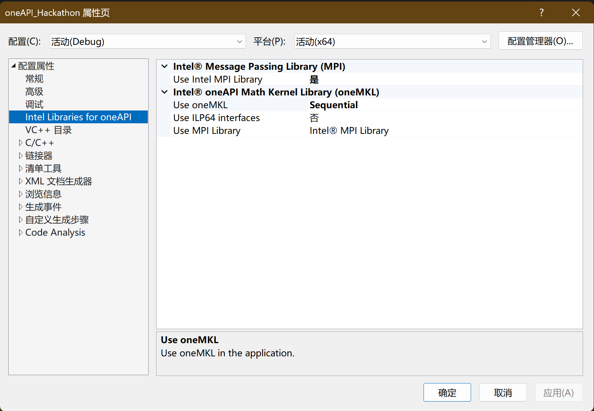
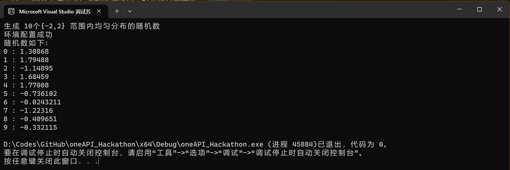
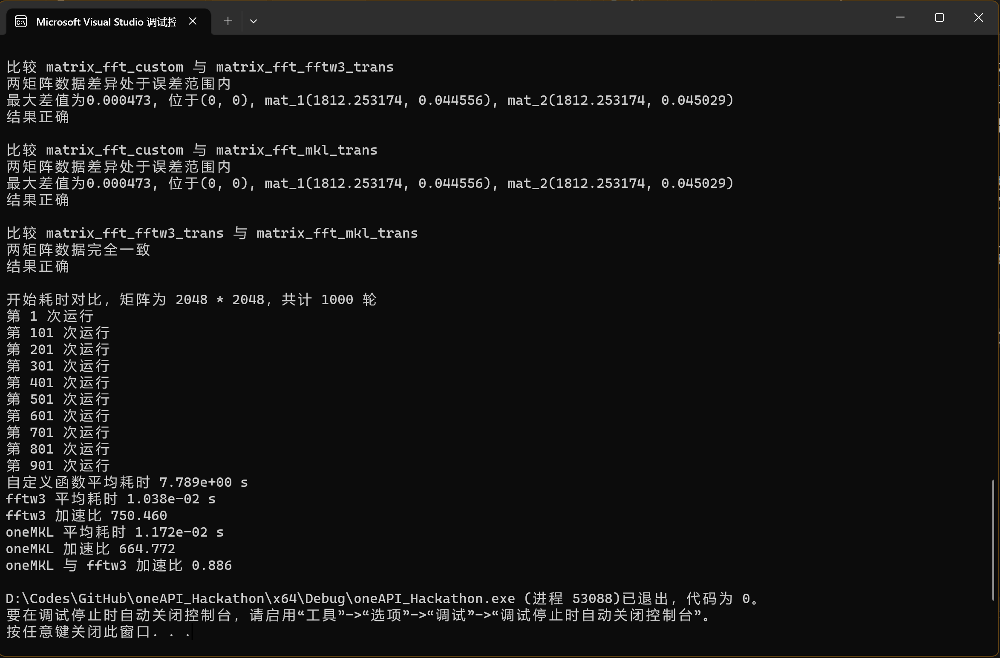

# oneAPI Hackathon

JamesZhutheThird

## Updates
- 20230827 v1.3 Finish tests and add analysis
- 20230826 v1.2 Fix bugs in customized FFT
- 20230826 v1.1 Add customized FFT (however there are bugs)
- 20230825 v1.0 Support FFT with `oneMKL` and `fftw3`

## 题目描述
使用oneMKL工具，对FFT算法进行加速与优化。
1. 点击链接下载和使用最新版本oneMKL
2. 调用 oneMKL 相应 API函数， 产生 2048 * 2048 个 随机单精度实数()；
3. 根据2产生的随机数据作为输入，实现两维 Real to complex FFT 参考代码；
4. 根据2产生的随机数据作为输入， 调用 oneMKL API 计算两维 Real to complex FFT；
5. 结果正确性验证，对3和4计算的两维FFT输出数据进行全数据比对（允许适当精度误差）， 输出 “结果正确”或“结果不正确”信息；
6. 平均性能数据比对（比如运行1000次），输出FFT参考代码平均运行时间和 oneMKL FFT 平均运行时间。

## 环境配置
平台 `12th Gen Intel(R) Core(TM) i7-12700H (2.30 GHz) with 32GB RAM`

操作系统 `Windows 11 Pro Insider Preview 25936.1000`

Visual Studio 2022 [【下载链接】](https://visualstudio.microsoft.com/zh-hans/vs/)

Intel oneMKL [【下载链接】](https://www.intel.cn/content/www/cn/zh/developer/tools/oneapi/onemkl-download.html) 安装时会自动配置VS2022

安装上述二者后直接新建项目，打开项目属性管理器，修改属性如下图所示

即可直接执行对应代码（对于需要执行的代码，右键单击`包括在项目中`，反之右键单击`从项目中排除`）

## oneMKL API测试
执行 [【test_oneMKL.cpp】](test_oneMKL.cpp) 中的测试代码（参考[【CSDN】](https://blog.csdn.net/qq_45731813/article/details/132183458)），测试结果如下图所示



则表示 oneMKL 安装成功

## 样例输出
执行 [【oneAPI_Hackathon.cpp】](oneAPI_Hackathon.cpp) 中的测试代码，测试结果如下图所示



```
...
比较 matrix_fft_custom 与 matrix_fft_fftw3_trans
两矩阵数据差异处于误差范围内
最大差值为0.000473, 位于(0, 0), mat_1(1812.253174, 0.044556), mat_2(1812.253174, 0.045029)
结果正确

比较 matrix_fft_custom 与 matrix_fft_mkl_trans
两矩阵数据差异处于误差范围内
最大差值为0.000473, 位于(0, 0), mat_1(1812.253174, 0.044556), mat_2(1812.253174, 0.045029)
结果正确

比较 matrix_fft_fftw3_trans 与 matrix_fft_mkl_trans
两矩阵数据完全一致
结果正确

开始耗时对比，矩阵为 2048 * 2048，共计 1000 轮
第 1 次运行
第 101 次运行
第 201 次运行
第 301 次运行
第 401 次运行
第 501 次运行
第 601 次运行
第 701 次运行
第 801 次运行
第 901 次运行
自定义函数平均耗时 7.789e+00 s
fftw3 平均耗时 1.038e-02 s
fftw3 加速比 750.460
oneMKL 平均耗时 1.172e-02 s
oneMKL 加速比 664.772
oneMKL 与 fftw3 加速比 0.886
```
2048*2048 矩阵FFT测试完整输出详见 [【output.txt】](output.txt)

## 性能对比及分析
对不同的矩阵大小，我们对每个算法多次执行，计算平均运行耗时。为保证数据足够精确，我们使用 `chrono` 库的 `high_resolution_clock`。每次对矩阵进行随机初始化之后，同时使用多个算法依次进行计算，以尽可能减少系统误差。

最终得出以下几点结论：
1. oneMKL 与 fftw3 均能对 fft 算法进行数十倍至上千倍的加速，oneMKL在小矩阵样例加速更显著，而在大矩阵时二者加速比接近不分伯仲
2. oneMKL 对比 fftw3 在非方阵矩阵上的表现更好
3. oneMKL 对于 1维 fft 的加速比相对更低一些，但仍然能达到数十倍的加速

|     M | N     |    自定义函数    |        fftw3 (加速比)         |       oneMKL (加速比)       | fftw3/oneMKL耗时比 |
|------:|:------|:-----------:|:--------------------------:|:------------------------:|:---------------:|
|     8 | 8     | 4.116e-05 s |   1.134e-06 s (36.314 x)   |  7.237e-07 s (56.877 x)  |      1.566      |
|    16 | 16    | 2.276e-04 s |   2.593e-06 s (87.799 x)   | 1.209e-06 s (188.317 x)  |      2.145      |
|    32 | 32    | 1.279e-03 s |  2.221e-06 s (576.010 x)   | 1.661e-06 s (770.499 x)  |      1.338      |
|    64 | 64    | 4.249e-03 s |  3.203e-05 s (132.679 x)   | 1.377e-05 s (308.613 x)  |      2.326      |
|   128 | 128   | 2.172e-02 s |  2.296e-05 s (945.844 x)   | 2.609e-05 s (832.356 x)  |      0.880      |
|   256 | 256   | 9.543e-02 s |  1.895e-04 s (503.503 x)   | 1.393e-04 s (685.225 x)  |      1.361      |
|   512 | 512   | 3.824e-01 s |  2.892e-04 s (1322.276 x)  | 4.358e-04 s (877.588 x)  |      0.664      |
|  1024 | 1024  | 1.870e+00 s |  2.675e-03 s (699.148 x)   | 3.676e-03 s (508.887 x)  |      0.728      |
|  2048 | 2048  | 7.789e+00 s |  1.038e-02 s (750.460 x)   | 1.172e-02 s (664.772 x)  |      0.886      |
|     1 | 4096  | 4.316e-03 s |  2.382e-05 s (181.208 x)   | 2.300e-05 s (187.635 x)  |      1.035      |
|    64 | 4096  | 3.924e-01 s |  3.051e-04 s (1285.901 x)  | 3.066e-04 s (1279.885 x) |      0.995      |
|  4096 | 4096  | 3.167e+01 s |  4.469e-02 s (708.686 x)   | 4.695e-02 s (674.683 x)  |      0.952      |
|     1 | 16384 | 2.025e-02 s |  8.622e-05 s (234.818 x)   | 8.408e-05 s (240.787 x)  |      1.025      |
|   128 | 16384 | 3.211e+00 s |  3.226e-03 s (995.177 x)   | 2.933e-03 s (1094.619 x) |      1.100      |
| 16384 | 16384 | 5.698e+02 s |  9.803e-01 s (581.193 x)   | 1.323e+00 s (430.782 x)  |      0.741      |
